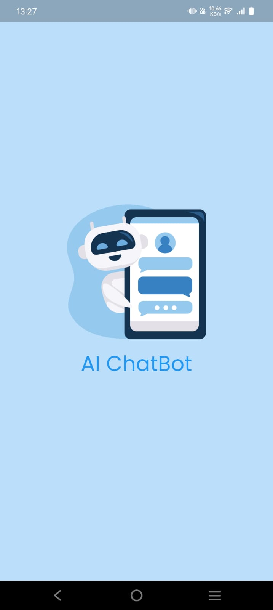
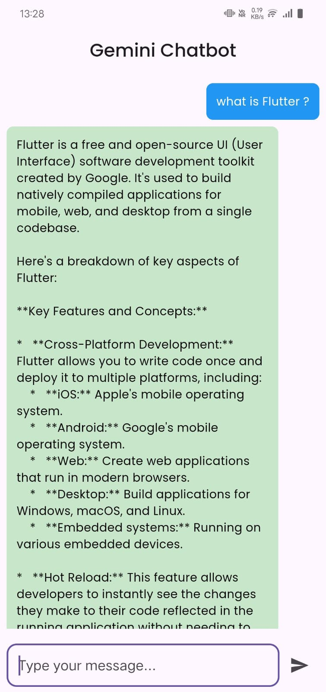
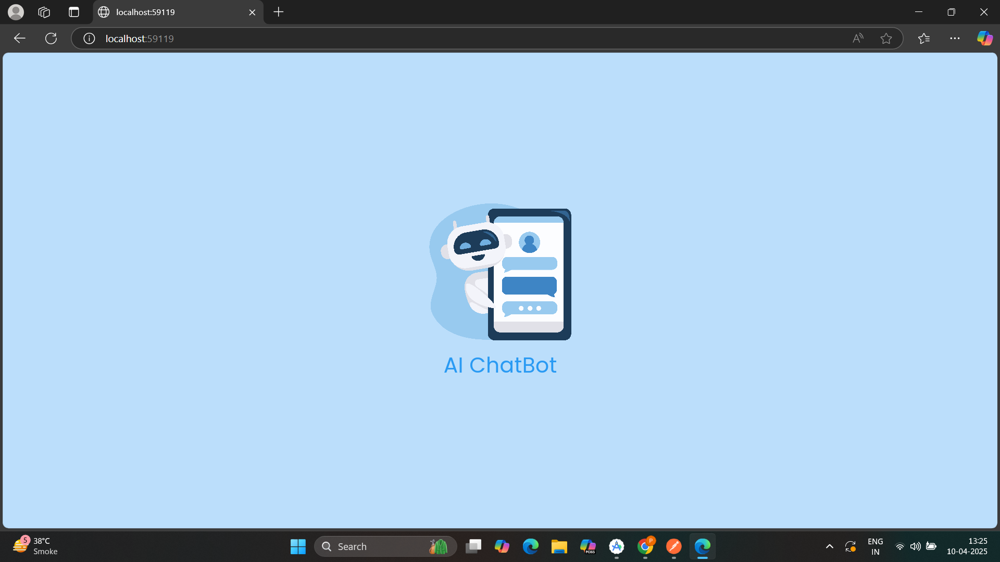
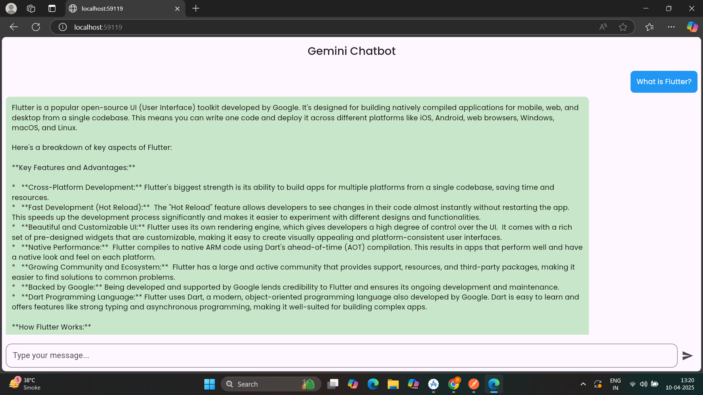

# 🤖 Gemini Chatbot

Gemini Chatbot is a fully responsive cross-platform Flutter application built using **BLoC state management**, featuring an animated splash screen, secure API handling, and a custom launcher icon. It interacts with the Gemini API to generate dynamic conversational responses.

---

## 🔧 Features

- ⚙️ **BLoC Pattern** for scalable, testable architecture.
- 📱 **Responsive UI** optimized for phones, tablets, and large screens.
- 💬 Real-time chatbot interface with user/bot messages.
- 🚀 **Animated Splash Screen** for a polished entry experience.
- 🛡️ **Secure API Key Handling** – keys are excluded from source control.
- 🎯 Custom **App Launcher Icon** for branding.
- 🏗️ **CI/CD Pipeline** for automated release builds via GitHub Actions.

---

📱 Screenshots

## Mobile
| Splash Screen | Chat Screen |
|---------------|-------------|
|  |  |

## Web
| Splash Screen | Chat Screen |
|---------------|-------------|
|  |  |

